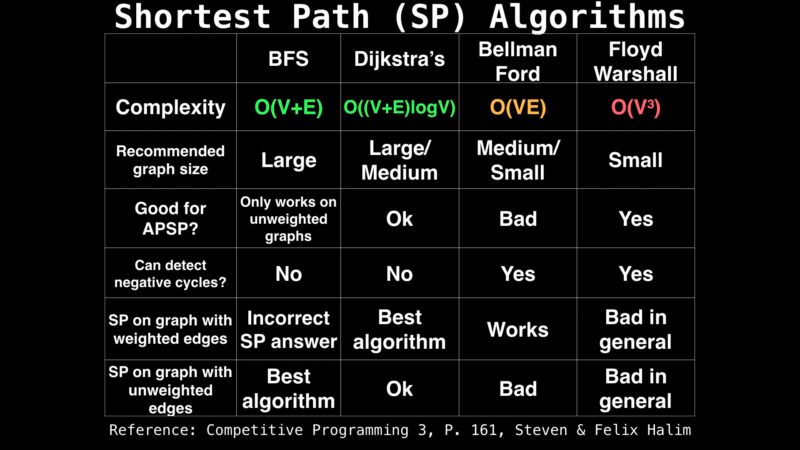

# cp-problems

A repository containing the hints and (my) solutions to some of the Leetcode problems. Can contain some common tips and strategies too that I may encounter during my journey with Competitive Programming.


## Concepts and some intuitive references:

### Recursion

[5 Simple Steps for Solving Any Recursion Problem](https://www.youtube.com/watch?v=ngCos392W4w)

### Depth-First Search:

**Use a Stack for DFS**

In Depth First Search, we recursively expand potential candidate until the defined goal is achieved. After that, we backtrack to explore the next potential candidate. Viewing this as a graph, we explore all the possibilities by going till the last node in that branch (exhausting the depth) and then jumping to the adjacent node to explore the other possibilities. This is known as Backtracking.

Given a graph adjacency dictionary containing the neighbors of each node, the dfs can be implemented as:

visited = set() # Set to keep track of visited nodes of graph.


def dfs(visited, graph, node):  #function for dfs 
    if node not in visited:
        print (node)
        visited.add(node)
        for neighbour in graph[node]:
            dfs(visited, graph, neighbour)

Breadth-First Search:

**Use a Queue for BFS**

In Breadth First Traversal, start from a source node and go to its left node then right node then do the same thing with the left node taking as the source then right node taking as the source

### Sliding Window:
When we are working with anested for loop where one of the for loops is running the same number of times for every i, use a sliding window technique

### Digit Dynamic Programming:

Refer to [this](https://youtu.be/sCwokuCoQB8) for an intuition!
Whenever we want to solve problems involving patterns in digits of numbers within a given range, digit dynamic programming helps!
Sequentially move forward by removing one digit at a time and checking for the conditions. Time complexity is O(log(n)^2)

### Bisect module

--> Works with sorted arrays, uses the concept of binary search
Returns the position where a new number should be inserted in a sorted array in O(logn). efficient because it reduces the overhead time to sort the list
insort() returns the sorted array after inserting the element in O(n)

### Bitmasking and DP

Use bitmasking when keeping a track of subsets included for a given setting. For example, if there are 5 persons and 1st and 4th of them are wearing a cap, then it can be represented with 10010. Then if we want to choose 1st person as the one wearing that hat, we can have a XOR on the other values (4th in this case).

### Trie (Prefix Tree)
[Implementation](https://leetcode.com/problems/implement-trie-prefix-tree/)

### Reservoir Sampling:
A family of randomized algorithms for sampling from a population of unknown size.

## building-heap-from-array
[Building Heap from Array](https://www.geeksforgeeks.org/building-heap-from-array/):
use heapify()
most of the operations in a heap are performed in log(n)

## Backtracking is not DFS!!

The difference is pruning of tree. Backtracking can stop (finish) searching certain branch by checking the given conditions (if the condition is not met). However, in DFS, you have to reach to the leaf node of the branch to figure out if the condition is met or not, so you cannot stop searching certain branch until you reach to its leaf nodes.

## Recursion and multiple outputs (possibilities)

whenever we need multiple outputs from a recursion, start with the first possibiility and go to its base case and append it to the output then and keep on doing this while coming back

## Questions giving conceptual clarity

### Backtracking:

**NOTE**: Always write a different dfs function to backtrack!

[Word Search](https://leetcode.com/problems/word-search/)

```python
class Solution:
    def exist(self, board: List[List[str]], word: str) -> bool:
        
        m, n = len(board), len(board[0])
        
        # define a function to return the answer for a gridpoint given a word
        def f(board, i, j, word, visited):
            
            # base case
            if len(word) == 1:
                return True
            
            dirs = [[0,1], [1,0], [-1,0], [0,-1]]
            
            for r, c in dirs:
                row, col = i+r, j+c
                if 0 <= row < m and 0 <= col < n and (row, col) not in visited and board[row][col] == word[1]:
                    visited.add((row,col))
                    if f(board, row, col, word[1:], visited):
                        return True
                    visited.remove((row,col))
                    
            return False
                
        for i in range(m):
            for j in range(n):
                if board[i][j] == word[0]:
                    visited = set()
                    visited.add((i,j))
                    if f(board, i, j, word, visited):
                        return True
        return False
```

[Combination Sum](https://leetcode.com/problems/combination-sum/)

```python
class Solution:
    def combinationSum(self, candidates: List[int], target: int) -> List[List[int]]:
        res = []
        
        def dfs(i, curr, total):
            if total == target:
                res.append(curr.copy())
                return
            if i>=len(candidates) or total > target:
                return
            curr.append(candidates[i])
            dfs(i, curr, total+candidates[i])
            curr.pop()
            dfs(i+1, curr, total)
        
        dfs(0, [], 0)
        return res
```

Maintain a global result variable when we need to return multiple outputs, can keep on appending the results in a top down approach or can try to append in a bottom up fashion just like in the following:

[Permutations](https://leetcode.com/problems/permutations/)

```python
class Solution:
    def permute(self, nums: List[int]) -> List[List[int]]:
        res = []
        
        if len(nums) == 1:
            res.append(nums[:])
            
        for i in range(len(nums)):
            n = nums.pop(0)
            perms = self.permute(nums)
            
            for perm in perms:
                perm.append(n)
            nums.append(n)
            res.extend(perms)
        
        return res
```
Its top down approach to maintain the answers:

```python
# DFS
def permute(self, nums):
    res = []
    self.dfs(nums, [], res)
    return res
    
def dfs(self, nums, path, res):
    if not nums:
        res.append(path)

    for i in range(len(nums)):
        self.dfs(nums[:i]+nums[i+1:], path+[nums[i]], res)
```

Preferred way: Maintain a global result variable and another function for the dfs and keep on appending the path to it and add it to the result when the base case hits and all the other conditions are valid. In permutations example, all the possibilites were supposed to be returned so the base case was the only condition but in the combination sum example, there were conditions imposed so if another condition was needed to handle that in addition to the base case. Also, there two recursive calls were needed with different path so the path was modified before calling it again!

Another thing is how many recursive calls to make inside the function! If there are n possibilities and all of them are unique such that it cannot be reached in the recursive call of any other, recurse on all of them otherwise try to minimise that! Because in the combination sum, since we are keeping track of two possibilities where 
1. We are choosing that number
2. We are not choosing that number

So, we need not recurse for all the numbers in the candidates list for all values since [2,6] will also be hit when the path would be [2, [], [], 6]!

### Graphs

To find the minimum distance to all the nodes given a start node and the adjacency matrix (O(V+E) since it's a BFS):
Try iterative BFS instead of recursive!

```python
def minDistance(adj, s):
    q = []
    q.append(s)
    dists = [0]*n ## n is the number of nodes
    dists[s] = 0 # assuming it is 0-indexed
    visited = set()
    visited.add(s)
    while q:
        cur = q.pop(0)
        for i in adj[cur]:
            if i not in visited:
                dists[i] = dists[cur] + 1
                q.append(i)
                visited.add(i)

    return dists
```
**VV Imp**: Since it's a BFS, the nodes that are reached earlier will automatically get the minimum distance value since they will not be visited later ever.

**Use Topological sorting to detect cycles in a DAG!**
Keep track of the cycles and return False as and when it is detected

```python
def dfs(s, visited, cycle):
    # if the node is there in a cycle then return False
    if s in cycle:
        return False
    # if the node is not in cycle but is still visited, it means it will not be in a cycle again and neither its children
    if s in visited:
        return True

    cycle.add(s)
    for n in adj[s]:
        if n not in visited:
            if dfs(n, visited, cycle) == False:
                return False
    cycle.remove(s)
    visited.add(s)
    return True
```

**Use topological sorting in DAGs to perform Bellman Ford** [Reference](https://www.techiedelight.com/cost-of-shortest-path-in-dag-using-one-pass-of-bellman-ford/)
Usually Bellman Ford is supposed to be run (n-1) times, where n is the number of nodes but if we choose the ordering of the edges in a topological manner, then we can reach the shortest paths in a single shot of Bellman Ford.

--> To perform topological sort given edges:

```python
visited = set()
departure = [-1 for i in range(n)]

# the following function will populate departure list in the opposite topological sorting: with the children before parents
def Tsort(s, visited, departure, time):
    visited.add(s)
    for u in adj[s]:
        if u not in visited:
            time = Tsort(u, visited, departure, time)
    departure[time] = s
    time = time+1
    return time

time = 0
for i in range(n):
    if i not in visited:
        time = Tsort(i, visited, departure, time)

reversed(departure) # this prints the topological sorting
```

Also, in order to find the longest path in a DAG with negative weights, just make the weights negative before relaxing the edges. Then the problem again becomes a shortest path algorithm! Refer to [this](https://www.techiedelight.com/find-cost-longest-path-dag/)

**SHORTEST PATH ALGORITHMS**
1. BFS
2. Dijkstra's (Implemented using a priority queue: fibonacci heap or binomial heap)
3. Bellman Ford
4. Floyd Warshall



## Trees

Three types of traversals:
1. Inorder (left --> root --> right)
2. Preorder (root --> left --> right)
3. Postorder (left --> right --> root)

[Binary Tree Inorder Traversal](https://leetcode.com/problems/binary-tree-inorder-traversal/)
```python
def inOrder(root):
    if not root:
        return []
    return self.inOrder(root.left) + [root.val] + self.inOrder(root.right)
```

[Cousins in Binary Tree](https://leetcode.com/problems/cousins-in-binary-tree/)
Trick: Maintain both parent and level while traversing each node! 
```python
def isCousins(self, root: Optional[TreeNode], x: int, y: int) -> bool:
    parent = {}
    
    def dfs(root, level, par=None):
        if root == None:
            return
        
        parent[root.val] = (level, par)
        
        dfs(root.left, level+1, root)
        dfs(root.right, level+1, root)
        
    dfs(root, 1)
    
    return parent[x][0] == parent[y][0] if parent[x][1] != parent[y][1] else False
```

[Maximum Depth of a Binary Tree](https://leetcode.com/problems/maximum-depth-of-binary-tree/)
```python
def maxDepth(root):
    if not root:
        return 0
    return max(self.maxDepth(root.left), self.maxdepth(root.right)) + 1
```

[Lowest Common Ancestor in a Binary Search Tree](https://leetcode.com/problems/lowest-common-ancestor-of-a-binary-search-tree/)
```python
def lowestCommonAncestor(self, root: 'TreeNode', p: 'TreeNode', q: 'TreeNode') -> 'TreeNode':
    if (p.val-root.val)*(q.val-root.val) <= 0:
        return root
    elif p.val < root.val or q.val < root.val:
        return self.lowestCommonAncestor(root.left, p, q)
    else:
        return self.lowestCommonAncestor(root.right, p, q)
```

[House Robber III](https://leetcode.com/problems/house-robber-iii/)
**Learnings**: When traversal/recursion has restriction on either choosing a node or leaving it while maximising some value: try to follow the strategy of maintaining [with_root, without_root] answers by using the without root values of children to calculate the answer of with root for the parents and the maximum is tracked by the without_root answers of children by applying a max on those (take the max of with root and without root answers for the children)!

```python
def rob(self, root: Optional[TreeNode]) -> int:
    def dfs(root):
        if not root:
            return [0, 0]
        
        left = dfs(root.left)
        right = dfs(root.right)
        
        return [root.val + left[1] + right[1], max(left)+max(right)]
    
    return max(dfs(root))
```

[Maximum Width of a Binary Tree](https://leetcode.com/problems/maximum-width-of-binary-tree/)
**Modified BFS**: Process all the nodes of a specific level together. So, run the pops of q for the length of q at any point of time.

```python
width = 1
q = [(root, 0)]
while q:
    if len(q) > 1:
        width = max(width, (q[-1][1] - q[0][1])+1)
    l = len(q)
    for i in range(l):
        cur, level = q.pop(0)
        if cur.right:
            q.append((cur.right, 2*level))
        if cur.left:
            q.append((cur.left, 2*level + 1))

return width
```

[Binary Tree Cameras](https://leetcode.com/problems/binary-tree-cameras/)
Trick: A **destructive bottom up approach** where the node values are changed according to the status of that node. It is made 1 if we need to place a camera (which only happens when none of its children have a camera) and is made 2 if it is already monitored by any of its child nodes.
```python
def minCameraCover(self, root: Optional[TreeNode]) -> int:
    # A destructive approach: Bottom Up Traversal
    def dfs(root):
        if not root:
            return 0
        count = dfs(root.left) + dfs(root.right)
        
        # 0 --> unmonitored
        # 1 --> monitored with camera
        # 2 --> monitored without camera
        
        ans = min(root.left.val if root.left else float('inf'), root.right.val if root.right else float('inf'))
        if ans == 0:
            root.val = 1
            count += 1
        elif ans == 1:
            root.val = 2
            
        return count
    
    return dfs(root) + (root.val == 0)
```

[Maximum Path Sum](https://leetcode.com/problems/binary-tree-maximum-path-sum/)
Maintain the maximum in each recursion including the root node but return a value which will have a split from either left or right + root node.
This way it ensures that even the recursive path (answer) is not disconnected. Also, use the keyword **nonlocal** if you want to change the value of a global variable inside a nested function! 
```python
res = root.val
def dfs(root):
    nonlocal res
    if not root:
        return 0
    left, right = dfs(root.left), dfs(root.right)
    leftMax, rightMax = max(left, 0), max(right, 0)

    res = max(res, root.val + leftMax + rightMax)

    return root.val + max(leftMax, rightMax)

dfs(root)
return res 
```

## Dynamic Programming

"Those who forget the past are condemned to repeat it."

Condition 1: If we can solve the problem using the answer to its subproblems!
Condition 2: If there are overlapping subproblems in the solution

**Try to find a recursive approach first and then optimise it using memoization or tabulation!**

**LIS variants:**
[Longest Increasing Subsequence](https://leetcode.com/problems/longest-increasing-subsequence/)
DP with Binary Search: Use the bisect module to maintain an array representing the length of the longest subsequence till there. 
NOTE: Here we are not using any special dp array that stores the results of every subarray but using a single array that is updated at every step and the final answer is the length of that array.

```python
import bisect
class Solution:
    def lengthOfLIS(self, nums: List[int]) -> int:
        LIS = []
        for num in nums:
            idx = bisect.bisect_left(LIS, num)
            if idx == len(LIS): LIS.append(num)
            else: LIS[idx] = num
        return len(LIS)
```

If we need to return the LIS and not just the length, then maintain a dp array which will store the LIS till that index which includes that value also then return the subsequence in that array having the largest length.

```python
class Solution:
    def lengthOfLIS(self, nums: List[int]) -> int:
        dp = [[x] for x in nums]
        for i in range(1, len(nums)):
            maxlen = 0
            for j in range(i):
                if dp[j][-1] < nums[i] and len(dp[j]) > maxlen: 
                    maxlen = len(dp[j])
                    dp[i] = dp[j] + [nums[i]]
        return sorted(dp, key=len)[-1]
```

Use the above method to obtain an answer subset and not just the length!

[Russian Dolls](https://leetcode.com/problems/russian-doll-envelopes/)
Sort the envelopes in ascending order of their widths and in case of a tie, sort according to their heights n descending order.
Then, the problem evaluates to an LIS on the height values.

```python
envelopes.sort(key=lambda i:(i[0], -i[1]))
LIS = []
for envelope in envelopes:
    idx = bisect.bisect_left(LIS, envelope[1])
    if idx == len(LIS): LIS.append(envelope[1])
    else: LIS[idx] = envelopes[1]
return len(LIS)
```

[Number of LIS](https://leetcode.com/problems/number-of-longest-increasing-subsequence/)

Maintain a count of the LIS present at every index alongwith the length of the LIS!

```python
class Solution:
    def findNumberOfLIS(self, nums: List[int]) -> int:
        dp = [1]*len(nums) # will store the length of the LIS 
        counts = [1]*len(nums) # will store the number of LIS present at that index
        ans, maxlen = 1, 1
        
        for i in range(1, len(nums)):
            count = 1
            for j in range(i):
                if nums[j] < nums[i]:
                    if (dp[j] + 1) > dp[i]:
                        count = counts[j]
                    elif (dp[j] + 1) == dp[i]:
                        count += counts[j]
                    dp[i] = max(dp[i], dp[j] + 1)
            counts[i] = count
            if dp[i] > maxlen:
                ans, maxlen = counts[i], dp[i]
            elif dp[i] == maxlen:
                ans += counts[i]
                
        return ans
```

Keep on maintaining a count of LIS at every index that includes it and whenever a subsequence with a greater length is encountered, reinitialise that count = counts[j] because there can be multiple subsets of that length that are present including that index value.

[Largest Divisible Subset](https://leetcode.com/problems/largest-divisible-subset/)
Use the same concept as LIS and update the condition to obtain the new subset out of all the previous subsets.

```python
class Solution:
    def largestDivisibleSubset(self, nums: List[int]) -> List[int]:
        dictionary={}   
        for i in sorted(nums):
            temp=[i]
            for key,value in dictionary.items():
                if i%key==0 and len(value)+1>len(temp):
                    temp=value+[i]
            dictionary[i]=temp
        return sorted(dictionary.values(),key=lambda x:len(x))[-1]
```

**Distinct Ways:**

[Partition Equal Subset Sum](https://leetcode.com/problems/partition-equal-subset-sum/)

A type of problem dealing with distinct ways: **include or exclude** while optimising for a value (check the next problem: Knapsack). Many subsets possible; will take 2^n recursions but can be further optimised using a 2D DP (for index and target remaining) and then either top down or bottom up approach! 

```python
class Solution:
    def canPartition(self, nums: List[int]) -> bool:
        if sum(nums) & 1 == 1: return False
        
        target = sum(nums)//2
        print(target)
        
        dp = [[-1 for j in range(target+1)] for i in range(len(nums))]
        
        def dfs(i, summ, dp):
            # this populates the dp matrix 
            
            if i == len(nums): return 0
            if summ < 0: return 0
            if summ == 0: return 1
            
            if dp[i][summ] != -1:
                return dp[i][summ]
            
            incl = dfs(i+1, summ - nums[i], dp)
            excl = dfs(i+1, summ, dp)
            
            dp[i][summ] = excl or incl
            return dp[i][summ]
        
        dfs(0, target, dp)
        return dp[0][target]
```

*ALTERNATIVE* : To store the number of possible sums, maintain a DP set
```python 
class Solution:
    def canPartition(self, nums: List[int]) -> bool:
        if sum(nums)%2 == 1: return False
        target = sum(nums)/2
        dp = set()
        dp.add(0)
        for i in range(len(nums)-1, -1, -1):
            nextDP = set()
            for t in dp:
                if (t+nums[i]) == target:
                    return True
                nextDP.add(t+nums[i])
                nextDP.add(t)
            dp = nextDP
        return target in dp
```

[0/1 Knapsack Problem]()

To maximise the value while checking all the subsets and restricted by the weight capacity of the knapsack:

```python
    def solve(i, capacity):
        if i==n-1:
            if w[i] <= capacity: return v[i]
            else: return 0
        if dp[i][capacity] != -1:
            return dp[i][capacity]
        if w[i] <= capacity:
            inc = solve(i+1, capacity-w[i])
        excl = solve(i+1, capacity)

        dp[i][capacity] = max(inc, excl)
        return dp[i][capacity]
```

**Longest Common Subsequence Variants:**

[Longest Common Subsequence](https://leetcode.com/problems/longest-common-subsequence/)

Use a 2D DP and traverse it based on decisions at each step
```python
class Solution:
    def longestCommonSubsequence(self, text1: str, text2: str) -> int:
        dp = [[-1 for i in range(len(text2))] for j in range(len(text1))]
        
        def dfs(i, j, dp):
            if i == len(text1) or j == len(text2): return 0
            if dp[i][j] != -1: return dp[i][j]
            if text1[i] == text2[j]:
                ans = 1 + dfs(i+1, j+1, dp)
            else:
                count2 = dfs(i+1, j, dp)
                count3 = dfs(i, j+1, dp)
                ans = max(count2, count3)
                
            dp[i][j] = ans
            return dp[i][j]
        
        ans = dfs(0, 0, dp)
        return ans
```

**Bitmasking:**
[Partition to K equal sum subsets]()

Track the elements that have been used already in an array and run the whole recursion until all the K subsets are not found.

```python
class Solution:
    def canPartitionKSubsets(self, nums: List[int], k: int) -> bool:
        # Try using bitmasking to keep track of the subsets that are already built
        if sum(nums) % k != 0: return False
        nums.sort(reverse=True)
        used = [False]*len(nums)
        target = sum(nums)//k
        
        def solve(i, k, total):
            if k == 0:
                return True
            if total == target: 
                return solve(0, k-1, 0)
            for j in range(i, len(nums)):
                if used[j] or used[j] + total > target:
                    continue
                used[j] = True
                if solve(j + 1, k, total + nums[j]): 
                    return True
                used[j] = False
            return False
            
        return solve(0, k, 0)
```


**Palindrome:**
[Palindromic Substrings](https://leetcode.com/problems/palindromic-substrings/)

If 'aba' is a palindrome then 'xabax' will also be a palindrome so try to move in both directions at every index to find the palindrome using two pointers. **Do this for both even and odd length palindromes**
```python
class Solution:
    def countSubstrings(self, s: str) -> int:
        count = 0
        for i in range(len(s)):
            # for odd length palindromes
            left, right = i, i
            while left >= 0 and right < len(s):
                if s[left] == s[right]: 
                    count += 1
                else:
                    break
                left -= 1
                right += 1
            
            # for even length palindromes
            left, right = i, i+1
            while left >= 0 and right < len(s):
                if s[left] == s[right]: 
                    count += 1
                else:
                    break
                left -= 1
                right += 1
                
        return count
```
[Palindromic Partitioning II](https://leetcode.com/problems/palindrome-partitioning-ii/)

The idea is to maintain the answers for a substring in a 1D array. Then the O(n^2) solution will traverse over all the array and will check for all possible palindromes to the right of that index and will find the minimum of all those possibilities by adding 1 to the valid answers (where a palindrome is found)!

```python
class Solution:
    def minCut(self, s: str) -> int:
        dp = [float('inf')]*(len(s)+1)
        dp[-1] = -1
        for i in range(len(s)-1, -1, -1):
            dp[i] = 1 + dp[i+1]
            for j in range(i+1, len(s)):
                word = s[i:j+1]
                if word == word[::-1]: 
                    dp[i] = min(dp[i], 1 + dp[j+1])
        return dp[0]
```


**Coin Change Variants**:

[Coin Change](https://leetcode.com/problems/coin-change/)

Maintain a 1D DP array to have all the sum possibilities till a given amount and then use those values to calculate the answer for the remaining amounts!
```python
class Solution:
    def coinChange(self, coins: List[int], amount: int) -> int:
        dp = [float('inf')]*(amount+1)
        dp[0] = 0
        for target in range(1, amount+1):
            for c in coins:
                if target-c >= 0:
                    dp[target] = min(dp[target-c]+1, dp[target])
        return dp[amount] if dp[amount]!=float('inf') else -1
```

[Combination Sum IV](https://leetcode.com/problems/combination-sum-iv/)

Use the same concept as Coin change and try to maintain the answer for all the possible targets and use them to calculate for the newer values
```python
class Solution(object):
    def combinationSum4(self, nums, target):
        """
        :type nums: List[int]
        :type target: int
        :rtype: int
        """
        dp = [0]*(target+1)
        dp[0] = 1
        
        for a in range(1, target+1):
            for num in nums:
                if a >= num:
                    dp[a] += dp[a-num]
                    
        return dp[target]
```

[Coin Change II](https://leetcode.com/problems/coin-change-ii/)

This is a bit different than combination sum IV because here we cannot repeat combinations like (2,1,1) and (1,2,1) are treated equally and not differently as it was done in combination sum IV. So, to avoid adding them up, keep on tracking the index also and use the answers at index i+1 for every i to write the final answers!

```python
class Solution:
    def change(self, amount: int, coins: List[int]) -> int:
        dp = [[0]*(len(coins)+1) for j in range(amount + 1)]
        dp[0] = [1] * (len(coins)+1)
        
        for a in range(1, amount+1):
            for i in range(len(coins)-1, -1, -1):
                dp[a][i] = dp[a][i + 1]
                if a - coins[i] >= 0:
                    dp[a][i] += dp[a - coins[i]][i]
        return dp[amount][0]
```

**Matrix Multiplication Variants**:

[Burst Balloons](https://leetcode.com/problems/burst-balloons/)

**V.V.Important Que**
Refer to the Neetcode video solution for easier understanding
```python
class Solution:
    def maxCoins(self, nums: List[int]) -> int:
        # O(n^3) solution
        # Think every balloon to be the last balloon to be popped instead of popping it as the first balloon. Then the individual subproblems can be identified!! 
        nums = [1] + nums + [1]
        dp = [[-1 for i in range(len(nums))] for j in range(len(nums))]
        
        @cache
        def solve(l, r):
            if l > r: return 0
            
            if dp[l][r] != -1: return dp[l][r]
            
            tot = 0
            for i in range(l, r+1):
                ans = nums[l-1] * nums[i] * nums[r+1]
                ans += solve(l, i-1) + solve(i+1, r)
                tot = max(tot, ans)
            
            dp[l][r] = tot
            return tot
            
        solve(1, len(nums)-2)
        return dp[1][len(nums)-2]
```

**Matrix/2DArray:**
[Matrix Block Sum](https://leetcode.com/problems/matrix-block-sum/)

**Trick**: Use prefix sum to calculate the block sums and then use those values to obtain the final values!


```python
class Solution:
    def matrixBlockSum(self, mat: List[List[int]], k: int) -> List[List[int]]:
        ## use the prefix sum values to calculate the answers for any k in O(m*n)
        m, n  = len(mat), len(mat[0])
        ans = [[0 for i in range(n)] for j in range(m)]
        for i in range(m):
            for j in range(1, n):
                mat[i][j] += mat[i][j-1] 
                
        for j in range(n):
            for i in range(1, m):
                mat[i][j] += mat[i-1][j] 
        
        for i in range(m):
            for j in range(n):
                # x1 and y1 are the bottom right corners and x2, y2 are the top left corners
                x1, y1, x2, y2 = min(i+k, m-1), min(j+k, n-1), max(0, i-k), max(0, j-k)
                ans[i][j] = mat[x1][y1] - (mat[x2-1][y1] if x2 > 0 else 0 ) - (mat[x1][y2-1] if y2 > 0 else 0) + (mat[x2-1][y2-1] if (x2 > 0 and y2 > 0) else 0)
        
        return ans
```

[Minimum Falling Path Sum](https://leetcode.com/problems/minimum-falling-path-sum/)

Populate an (m*n) dp marix to store the minimum falling path of every gridpoint by recursing for each column in the first row to the last row. Return the minimum value from the first row!
A bottom up approach is mentioned in the Minimum Path Sum answer below!

```python
class Solution:
    def minFallingPathSum(self, matrix: List[List[int]]) -> int:
        
        m, n = len(matrix), len(matrix[0])
        
        def dfs(i, j, summ):
            if dp[i][j] != float('inf'): return dp[i][j]
            
            if i == (m-1):
                dp[i][j] = matrix[i][j]
                return matrix[i][j]
            
            dirs = [[1,1], [1,0], [1,-1]]
            ans = float('inf')
            for r, c in dirs:
                row, col = i+r, j+c
                if 0 <= row < m and 0 <= col < n:
                    ans = min(ans, dfs(row, col, summ)+matrix[i][j])
            dp[i][j] = ans
            
            return dp[i][j]
        
        dp = [[float('inf') for i in range(m)] for j in range(n)]
        
        for j in range(n): dfs(0, j, 0)
        return min(dp[0][i] for i in range(n))
```

[Dungeon Game](https://leetcode.com/problems/dungeon-game/)

If I am at (i,j) and I know the minimum health required to start at (i+1, j) or (i, j+1) and still have >0 health at the bottom right then, the answer at (i, j) = max(1, min(dp[i+1][j], dp[i][j+1]) - val[i][j]) because if at any point, the value goes negative or 0, we make 1 as the minimum health required to start at that gridpoint!

TRICK: Keep on traversing backwards by maintaining positive health all the time!

```python
class Solution:
    def calculateMinimumHP(self, dungeon: List[List[int]]) -> int:
        m, n = len(dungeon), len(dungeon[0])
        dp = [[0 for i in range(n)] for j in range(m)]
        dp[m-1][n-1] = abs(dungeon[m-1][n-1]) + 1 if dungeon[m-1][n-1] < 0 else 1
        
        for i in range(m-1, -1, -1):
            for j in range(n-1, -1, -1):
                if i == m-1 and j == n-1: continue
                path1, path2 = float('inf'), float('inf')
                if i+1 < m:
                    path1 = dp[i+1][j]
                if j+1 < n:
                    path2 = dp[i][j+1]
                dp[i][j] = max(1, min(path1, path2) - dungeon[i][j])
        
        return dp[0][0]
```

[Minimum Path Sum](https://leetcode.com/problems/minimum-path-sum/)
(Variant of Minimum Falling Path Sum)

Preferably do a bottom up approach and keep on calculating the answers in the array itself!

```python
class Solution:
    def minPathSum(self, grid: List[List[int]]) -> int:
        m, n = len(grid), len(grid[0])
        
        for i in range(m-1, -1, -1):
            for j in range(n-1, -1, -1):
                path1, path2 = float('inf'), float('inf')
                if i+1 < m:
                    path1 = grid[i+1][j]
                if j+1 < n:
                    path2 = grid[i][j+1]
                if i==m-1 and j==n-1: continue
                grid[i][j] += min(path1, path2)
        
        return grid[0][0]
```

**Hash+DP**:
[Target Sum](https://leetcode.com/problems/target-sum/)

NOTE: Make sure to check till the last index since there are negative values too so doing (total > target) might lead to wrong answers!

```python
class Solution:
    def findTargetSumWays(self, nums: List[int], target: int) -> int:
        
        dp = {}
        
        def dfs(i, total):
            if i == len(nums):
                if total == target: return 1
                else: return 0
            if (i, total) in dp: return dp[(i, total)]
            ans = dfs(i+1, total - nums[i]) + dfs(i+1, total + nums[i])
            dp[(i, total)] = ans
            return ans
            
        return dfs(0, 0)
```

**State Machine**:

[Buy and Sell Stock](https://leetcode.com/problems/best-time-to-buy-and-sell-stock/)
Try to track the profit and minimum values processed till index i and update them accordingly!

```python
class Solution:
    def maxProfit(self, prices: List[int]) -> int:
        minPrice = prices[0]
        profit = 0
        for price in prices:
            profit = max(profit, price-minPrice)
            minPrice = min(minPrice, price)
        return profit
```

[Buy and Sell Stock II](https://leetcode.com/problems/best-time-to-buy-and-sell-stock-ii/)

The Top-down approach:
```python
class Solution:
    def maxProfit(self, prices: List[int]) -> int:
        
        # buying will mean:
        # 0 --> has no stock
        # 1 --> has a stock
        dp = dict()
        
        def dfs(day, buying, profit):
            
            if day >= len(prices): 
                return 0
            if (day, buying) in dp: return dp[(day, buying)]
            cooldown = dfs(day+1, buying, profit)
            if not buying:
                buy = -prices[day] + dfs(day+1, not buying, profit)
                dp[(day, buying)] = max(cooldown, buy)
                return dp[(day, buying)]
            else:
                sell = prices[day] + dfs(day+1, not buying, profit)
                dp[(day, buying)] = max(sell, cooldown)
                return dp[(day, buying)]
        
        return dfs(0, 0, 0)
```

An alternative greedy solution:
```python
class Solution:
    def maxProfit(self, prices: List[int]) -> int:
        profit = 0
        for i in range(len(prices)-1):
            if prices[i] < prices[i+1]:
                profit += prices[i+1] - prices[i]
        return profit
```

[Buy and Sell Stock III](https://leetcode.com/problems/best-time-to-buy-and-sell-stock-iii/)

The DP with caching (Top-down approach):

```python
class Solution:
    def maxProfit(self, prices: List[int]) -> int:
        dp = dict()
        def solve(i, owning, k):
            if k == 2 or i == len(prices): return 0
            if (i, owning, k) in dp: return dp[(i, owning, k)]
            cooldown = solve(i+1, owning, k)
            
            if owning:
                sell = prices[i] + solve(i+1, not owning, k+1)
                dp[(i, owning, k)] = max(sell, cooldown)
                return max(sell, cooldown)
            else:
                buy = solve(i+1, not owning, k) - prices[i]
                dp[(i, owning, k)] = max(buy, cooldown)
                return max(buy, cooldown)
            
        return solve(0, 0, 0)
```

[Buy and Sell Stock IV](https://leetcode.com/problems/best-time-to-buy-and-sell-stock-iv/)

Make sure to increase the count only when the transaction is completed: i.e., when the bought stock is sold

```python
class Solution:
    def maxProfit(self, k: int, prices: List[int]) -> int:
        dp = [[[-1 for a in range(k+1)] for b in range(2)] for c in range(len(prices) + 1)]
        
        def dfs(i, owning, count):
            if count == k or i == len(prices): return 0
            if dp[i][owning][count] != -1: return dp[i][owning][count]
            
            cooldown = dfs(i+1, owning, count)
            
            if owning:
                sell = dfs(i+1, not owning, count + 1) + prices[i]
                dp[i][owning][count] = max(sell, cooldown)
                return max(sell, cooldown)
            else:
                buy = dfs(i+1, not owning, count) - prices[i]
                dp[i][owning][count] = max(buy, cooldown)
                return max(buy, cooldown)
            
        return dfs(0, 0, 0)
```

[Buy and Sell Stock with cooldown](https://leetcode.com/problems/best-time-to-buy-and-sell-stock-with-cooldown/)

[Buy and Sell Stock with transaction fee](https://leetcode.com/problems/best-time-to-buy-and-sell-stock-with-transaction-fee/)

```python
class Solution:
    def maxProfit(self, prices: List[int], fee: int) -> int:
        dp = dict()
        
        def dfs(day, buying, profit):
            if day >= len(prices): 
                return 0
            
            if (day, buying) in dp: return dp[(day, buying)]
            
            cooldown = dfs(day+1, buying, profit)
            
            if not buying:
                buy = -prices[day] + dfs(day+1, not buying, profit) - fee
                dp[(day, buying)] = max(cooldown, buy)
                return dp[(day, buying)]
            else:
                sell = prices[day] + dfs(day+1, not buying, profit)
                dp[(day, buying)] = max(sell, cooldown)
                return dp[(day, buying)]
        
        return dfs(0, 0, 0)
```

**Depth-First Search + DP**

[Out of Boundary Paths](https://leetcode.com/problems/out-of-boundary-paths/)
Use normal DFS to traverse but keep on storing the answers in a dictionary of tuples: (row, col, moves)
Remember about one of the other base cases where moves = 0 but the ball is still in bounds then return 0

```python
class Solution:
    def findPaths(self, m: int, n: int, maxMove: int, startRow: int, startColumn: int) -> int:
        dp = dict()
        mod = pow(10, 9) + 7
        def solve(i, j, moves):
            # base cases to return a 1 if the ball goes out of boundary
            if moves>=0 and (i<0 or i>=m or j>=n or j<0): return 1
            elif moves==0 and (0<=i<m and 0<=j<n): return 0
            elif (i, j, moves) in dp: return dp[(i, j, moves)]
            else:
                # include memoization here
                dirs = [[1,0], [0,1], [-1,0], [0,-1]]
                ans = 0
                for r, c in dirs:
                    row, col = i+r, j+c
                    ans += solve(row, col, moves-1)
                dp[(i,j,moves)] = ans
                return ans
        return solve(startRow, startColumn, maxMove) % mod
```

**Minmax DP**

[Predict the winner](https://leetcode.com/problems/predict-the-winner/)

The two types of recursive calls made here involve both minimising and maximising! 
```python
class Solution:
    def PredictTheWinner(self, nums: List[int]) -> bool:
        total = sum(nums)
        n = len(nums)
        dp = dict()
        # player --> 0 is Tom
        # player --> 1 is Jerry
        def dfs(i, j, player):
            # This function will try to find the maximum points player 1 can obtain with that state!
            if i > j: return 0
            if (i, j, player) in dp: return dp[(i, j, player)]
            if player == 0:
                dp[(i, j, player)] = max(nums[i] + dfs(i+1, j, 1), nums[j] + dfs(i, j-1, 1))
            else:
                # When player 2 is playing, he will try to minimise the points player 1 can make at that state!
                dp[(i, j, player)] = min(dfs(i+1, j, 0), dfs(i, j-1, 0))
            return dp[(i, j, player)]
        one = dfs(0, n-1, 0)
        two = total - one
        return (one >= two)
        
```

**Prefix Sum DP**

[Maximum Number of Points with Cost](https://leetcode.com/problems/maximum-number-of-points-with-cost/)

Refer to [this video](https://www.youtube.com/watch?v=P4Z9XdHAE4o) for more detailed solution and animation!
**Imp**: Calculating the modified prefix max and modified suffix max to keep track of the max present before and after any array element (both in prefix and suffix respectively)!
Use the new row computed using these prefixes and suffixes to calculate the further prefMax and sufMax arrays to obtain the next row of dp!

```python
class Solution:
    def maxPoints(self, points: List[List[int]]) -> int:
        m, n = len(points), len(points[0])
        
        def prefMax(r):
            pref = [0]*(n+1)
            for c in range(n):
                pref[c+1] = max(pref[c] - 1, dp[r][c])
            return pref
        
        def sufMax(r):
            suf = [0]*(n+1)
            for c in range(n-1, -1, -1):
                suf[c] = max(suf[c+1] - 1, dp[r][c])
            return suf
        
        dp = copy.deepcopy(points)
        
        for r in range(1, m):
            pref = prefMax(r-1)
            suf = sufMax(r-1)
            for c1 in range(n):
                dp[r][c1] = points[r][c1] + max(pref[c1+1], suf[c1])
                
        return max([dp[m-1][i] for i in range(n)])
```

**Two Pointers**

Two pointers can help in improving the Time Complexities drastically. Instead of using two for loops, sometimes two pointers can be used in a logical way to do the job in a single iteration! 

[Two Sum]()

This question can be done in O(n) TC using a hashmap (O(n) SC) but it can also be done in O(nlogn) TC but O(1) SC using two pointers.

```python
i, j = 0, n-1
nums.sort()
while i < j:
    summ = nums[i] + nums[j]
    if summ < target: i += 1
    elif summ > target: j -= 1
    else: return True

return False
```

[Three Sum](https://leetcode.com/problems/3sum/)

This can be done in O(n^2) by breaking it into a two sum problem for every element! Remember lo < hi in the condition and not lo <= hi

```python
class Solution:
    def threeSum(self, nums: List[int]) -> List[List[int]]:
        nums.sort()
        ans = set()
        for i, a in enumerate(nums):
            lo, hi = i+1, len(nums)-1
            target = -a
            while lo < hi:
                summ = nums[lo] + nums[hi]
                if (summ > target): hi -= 1
                elif (summ < target): lo += 1
                else: 
                    if (a, nums[lo], nums[hi]) not in ans:
                        ans.add((a, nums[lo], nums[hi]))
                    else: 
                        hi -= 1
                        lo += 1
        return ans
```
[Maximum Matching of Players with Trainers](https://leetcode.com/problems/maximum-matching-of-players-with-trainers/)

```python
class Solution:
    def matchPlayersAndTrainers(self, players: List[int], trainers: List[int]) -> int:
        i, j, res = 0, 0, 0
        players.sort()
        trainers.sort()
        while i < len(players) and j < len(trainers): 
            if players[i] > trainers[j]: j += 1
            else: 
                res += 1
                i += 1
                j += 1
                
        return res
```

[Watering Plants II](https://leetcode.com/problems/watering-plants-ii/)

```python
class Solution:
    def minimumRefill(self, plants: List[int], capacityA: int, capacityB: int) -> int:
        i, j = 0, len(plants)-1
        res = 0
        A, B = capacityA, capacityB
        while i <= j:
            if i == j:
                if plants[i] <= capacityA or plants[i] <= capacityB: i += 1
                else:
                    res += 1
                    i += 1
            else:
                if plants[i] <= capacityA: capacityA -= plants[i]
                else: 
                    capacityA = A
                    res += 1
                    capacityA -= plants[i]
                i += 1
                if plants[j] <= capacityB: capacityB -= plants[j]
                else: 
                    capacityB = B
                    res += 1
                    capacityB -= plants[j]
                j -= 1
        return res
```

[Trapping Rain Water]()

Using two pointers l and r as 0 and (n-1)


[Find the Duplicate Number](https://leetcode.com/problems/find-the-duplicate-number/)

Refer to [this](https://www.youtube.com/watch?v=wjYnzkAhcNk) video solution.
This is a Linked List Cycle Detection problem and the algorithm used is the Floyd's Cycle Detection Algo.

```python
class Solution:
    def findDuplicate(self, nums: List[int]) -> int:
        # Linked List cycle detection (two pointers: fast and slow)
        fast, slow = 0, 0
        while True:
            slow = nums[slow] # move 1 step
            fast = nums[nums[fast]] # move 2 steps further
            if fast == slow:
                break
        # Initialise another slow pointer and use it to reach the previous slow pointer
        slow2 = 0
        while True:
            slow = nums[slow]
            slow2 = nums[slow2]
            if slow == slow2:
                return slow
```

[Sort Colors](https://leetcode.com/problems/sort-colors/)

Optimal Approach: Using Dutch National Flag Algorithm

This algorithm works with three pointers, low, mid and high and runs until all the 0's are on the left side of mid and all the 2's are on the right side of the high.

NOTE: When a 2 is found by mid, DO NOT increment the mid pointer.

```python
class Solution:
    def sortColors(self, nums: List[int]) -> None:
        """
        Do not return anything, modify nums in-place instead.
        """
        # Dutch National Flag Algorithm
        low, high, mid = 0, len(nums) - 1, 0
        
        while mid <= high:
            if nums[mid] == 0: 
                nums[mid], nums[low] = nums[low], nums[mid]
                low += 1
                mid += 1
            elif nums[mid] == 2: 
                nums[mid], nums[high] = nums[high], nums[mid]
                high -= 1
            else:
                mid += 1
```

**Sliding Window**

--> Subarray and substrings are continuous
--> Subset and subsequences need not be continuous

So, sliding window should ideally work for subarrays and substrings whereas subsets and subsequences might need somethng like DP or recursion for 0/1 choice.

1. Fixed Size Window
2. Variable Size Window

If given subarray/substring and largest/smallest of something and either a window size is given or is asked for then think about sliding window once!

To check if a string or array is a permutation of any other: we can compare the character/integer frequencies


[MONOTONICALLY DECREASING QUEUE:](https://www.youtube.com/watch?v=DfljaUwZsOk)
We are adding the values to the queue in a decreasing order but as soon as we obtain a greater value, we remove all the previously added smaller value because we will never consider them to be the answer until the greater value is reached and popped in the windows. However, the values smaller occuring after the greater value are also added to the queue since they can potentially be the answers for the upcoming windows when the greater value is out of bounds!

**Greedy Algorithms**

We try to proceed by calculating the local optimum at every moment to find the final optimum.

--> Activity Selection

[N meetings in one room](https://practice.geeksforgeeks.org/problems/n-meetings-in-one-room-1587115620/1)
Sort according to the end time and then use greedy approach!

```python
class Solution:
    
    #Function to find the maximum number of meetings that can
    #be performed in a meeting room.
    def maximumMeetings(self,n,start,end):
        meetings = [(start[i], end[i]) for i in range(n)]
        meetings.sort(key=lambda i:i[1])
        start, end = meetings[0][0], meetings[0][1]
        count = 1
        
        for i in range(1, len(meetings)):
            if meetings[i][0] > end:
                end = meetings[i][1]
                count += 1
        return count
```

**Heaps**

**IMP**: When finding the kth smallest, use the maxHeap and when finding the kth largest, use a minHeap!
The heapq module can find the k largest or smallest elements in an iterable using nlargest(k, nums) and nsmallest(k, nums).
In order to implement a max Heap, use the negative values as input to the heap structure and check if -newVal < heap[0]: then push it to the heap

[Find K Pairs with Smallest Sums](https://leetcode.com/problems/find-k-pairs-with-smallest-sums/)

We can input a list into a heap then it sorts according to the first element by default.
```python
class Solution:
    def kSmallestPairs(self, nums1: List[int], nums2: List[int], k: int) -> List[List[int]]:
        queue = []
        def push(i, j):
            if i < len(nums1) and j < len(nums2):
                heapq.heappush(queue, [nums1[i] + nums2[j], i, j])
        push(0, 0)
        pairs = []
        while queue and len(pairs) < k:
            _, i, j = heapq.heappop(queue)
            pairs.append([nums1[i], nums2[j]])
            push(i, j + 1)
            if j == 0:
                push(i + 1, 0) # because start traversing the next row, only when the first character of that row is found as the smaller value than the previous row!!
        return pairs
```

**Prefix Sum**

**Binary Search**

You should know how to reduce your search space based on the conditions given in the questions!

**Game Theory**

[Stone Game](https://leetcode.com/problems/stone-game/)

Instead of using a dp array, @lru_cache(maxsize=None) does the job! 
The solution is an optimal strategy where the function defines the final output for only one player and the recursive calls are made in an intuitive manner. When the defining player is playing, we use max and add the chosen values but when the other player is playing, the score of the defining player will be the minimum of the possible next chances, and more importantly, no value is added in this case since the defining player is not playing in this round!

```python
    def stoneGame(self, piles: List[int]) -> bool:
        @lru_cache(maxsize=None)
        def turn(start, end, chance):
            if start > end: return 0
            if chance == 0: # Alice
                ans = max(piles[start] + turn(start+1, end, not chance), piles[end] + turn(start, end - 1, not chance))
            else:
                ans = min(turn(start+1, end, not chance), turn(start, end - 1, not chance))
            return ans
        total = sum(piles)
        alice = turn(0, len(piles)-1, 0)
        return alice > (total - alice)
```

[Predict the Winner](https://leetcode.com/problems/predict-the-winner/)

Very similar to Stone Game!

```python
class Solution:
    def PredictTheWinner(self, nums: List[int]) -> bool:
        total = sum(nums)
        n = len(nums)
        # player --> 0 is Tom
        # player --> 1 is Jerry
        @lru_cache(maxsize=None)
        def dfs(i, j, player):
            # This function will try to find the maximum points player 1 can obtain with that state!
            if i > j: return 0
            if player == 0:
                ans = max(nums[i] + dfs(i+1, j, 1), nums[j] + dfs(i, j-1, 1))
            else:
                # When player 2 is playing, he will try to minimise the points player 1 can make at that state!
                ans = min(dfs(i+1, j, 0), dfs(i, j-1, 0))
            return ans
        one = dfs(0, n-1, 0)
        two = total - one
        return (one >= two)
```

[Stone Game IV](https://leetcode.com/problems/stone-game-iv/)

This is different than Stone Game because here, the defining state is only the number of stones and the player is implicit in there. So, same actions are taken by each player and the one reaching the zero will lose and the other will win!

```python
class Solution:
    def winnerSquareGame(self, n: int) -> bool:

        @lru_cache(maxsize=None)
        def dfs(remain):
            if remain == 0:
                return False

            sqrt_root = int(remain**0.5)
            for i in range(1, sqrt_root+1):
                # if there is any chance to make the opponent lose the game in the next round,
                #  then the current player will win.
                if not dfs(remain - i*i):
                    return True

            return False

        return dfs(n)
```

[Nim Game](https://leetcode.com/problems/nim-game/)

In this, we can't really use the Stone Game IV trick because the values are very very high 2^31 - 1, the maximum recursion depth will be exceeded. It's a trick question

```python
class Solution:
    def canWinNim(self, n: int) -> bool:
        return n % 4 != 0
```